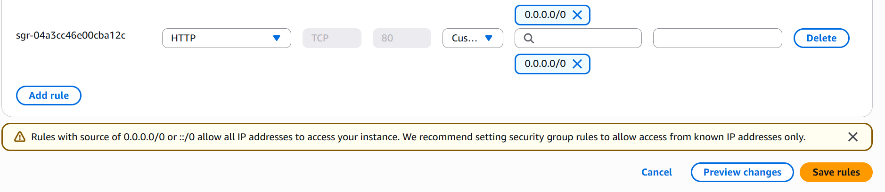
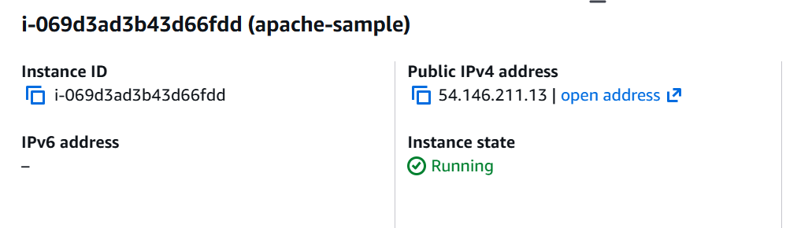
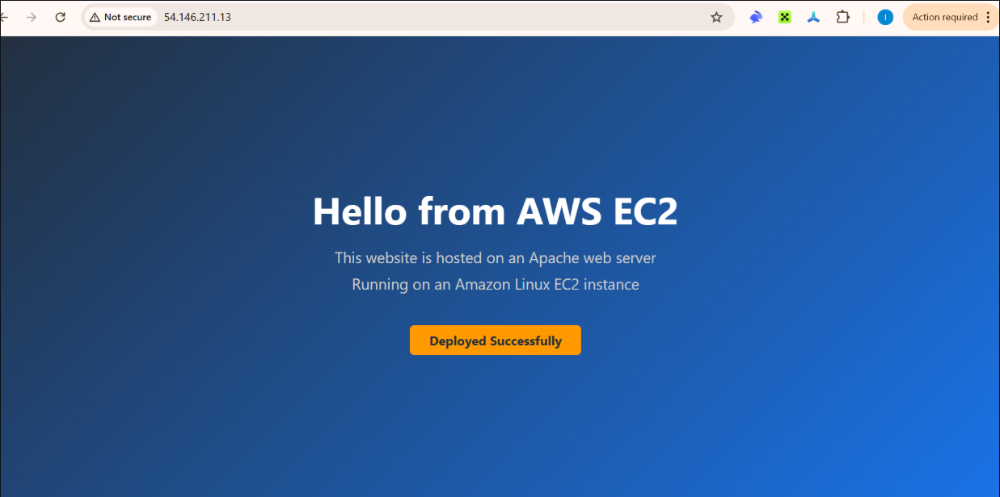

# My First AWS EC2 Deployment: Apache & Nginx

This project showcases my first hands-on experience with cloud computing by launching and connecting to a virtual server using Amazon EC2.

As an aspiring DevOps Engineer, I wanted to understand how cloud infrastructure works in real-world scenarios. This project helped me gain practical knowledge of provisioning, configuring, and accessing a remote Linux server.

### Tech Stack
- AWS (Amazon Web Services)
- EC2 
- Amazon Linux
- SSH
- Command Line Interface (CLI)

## Deployment Steps

1. Access AWS Console
2. Launch Instance
3. Configure Security Group
- Rule 1: SSH | Port 22| Source: My IP
- Rule 2: HTTP|Port 80| Source:0.0.0.0/0 (Anywhere)



4. Create Key Pair
5. Launch the instance

## Connecting to the Server and install Apache 
````
chmod 400 my-key.pem 
ssh -i my-key.pem amazon@<your-public-ip>
````
It is now time to install Apache using the following commands
````
sudo dnf update -y
sudo dnf install -y httpd
````
Now, Apache is installed. Open your browser and go to: http://<your-ec2-public-ip> Use reference from image to copy your public ip



You should see the default Apache page.

## Replace with Your Own Website
It's now time to replace what is showing in the default page with your own website. The default website files are stored in /var/www/html/ Use this command to edit the files: sudo vim /var/www/html/index.html Place what is inside your index.html page in here. Save and exit. Now, go back to your url and refresh, and you'll see your application working. This is how your webpage will look like:



Useful Commands
- sudo systemctl status httpd
- sudo systemctl restart httpd
- sudo systemctl stop httpd
- sudo systemctl start httpd

## Launch using Nginx

After ssh, run the following commands to install Nginx
````
sudo dnf update -y
sudo dnf install -y nginx
````
## Start and enable Nginx
````
sudo systemctl start nginx
sudo systemctl enable nginx
````
Confirm that it works: Open your browser and go to: http://<your-ec2-public-ip> 

## Replace with your website
Use the command
````
sudo vim /usr/share/nginx/html/index.html
```` 
to get to the index.html file and replace the default nginx page with the index.html file on this repo.

Check your public ip and it has magically updated.

##Useful commands
- sudo systemctl status nginx
- sudo systemctl restart nginx
- sudo systemctl stop nginx
- sudo nginx -t

[def]: ec2-1.png